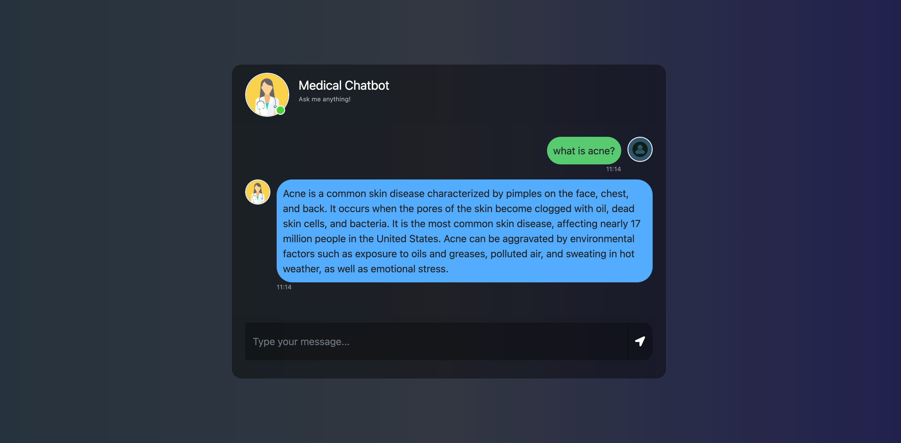
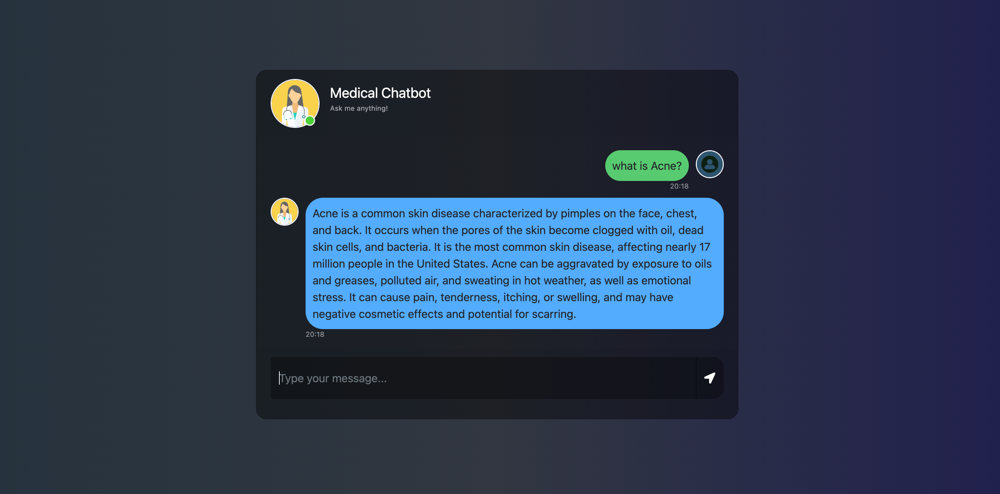
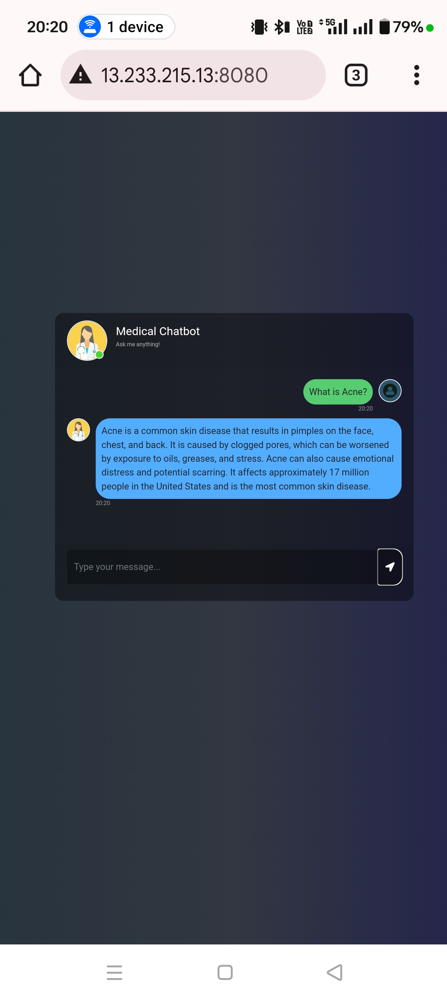

# MedicalchatBot
# Agenda
It's an AI designed to provide users with medical information, preliminary guidance on symptoms, and answers to common healthcare-related queries.

### Local Run

sentence-transformers == 3.3.1
langchain
flask
pypdf
torch
transformers
python-dotenv
pinecone[grpc]
langchain-pinecone
langchain_community
langchain_openai
langchain_experimental
openai
InstructorEmbedding

# AWS-CICD-Deployment-with-Github-Actions

## 1. Login to AWS console.

## 2. Create IAM user for deployment

	#with specific access

	1. EC2 access : It is virtual machine

	2. ECR: Elastic Container registry to save your docker image in aws

	#Description: About the deployment

	1. Build docker image of the source code

	2. Push your docker image to ECR

	3. Launch Your EC2 

	4. Pull Your image from ECR in EC2

	5. Lauch your docker image in EC2

	#Policy:

	1. AmazonEC2ContainerRegistryFullAccess

	2. AmazonEC2FullAccess

	
## 3. Create ECR repo to store/save docker image
    - Save the URI: 970547337635.dkr.ecr.ap-south-1.amazonaws.com/medicalchatbot

	
## 4. Create EC2 machine (Ubuntu) 

## 5. Open EC2 and Install docker in EC2 Machine:
	
	
	#optinal

	sudo apt-get update -y

	sudo apt-get upgrade
	
	#required

	curl -fsSL https://get.docker.com -o get-docker.sh

	sudo sh get-docker.sh

	sudo usermod -aG docker ubuntu

	newgrp docker
	
# 6. Configure EC2 as self-hosted runner:
    setting>actions>runner>new self hosted runner> choose os> then run command one by one

# 7. Setup github secrets:

   - AWS_ACCESS_KEY_ID
   - AWS_SECRET_ACCESS_KEY
   - AWS_DEFAULT_REGION
   - ECR_REPO
   - PINECONE_API_KEY
   - OPENAI_API_KEY

# On Production

# On Mobile

